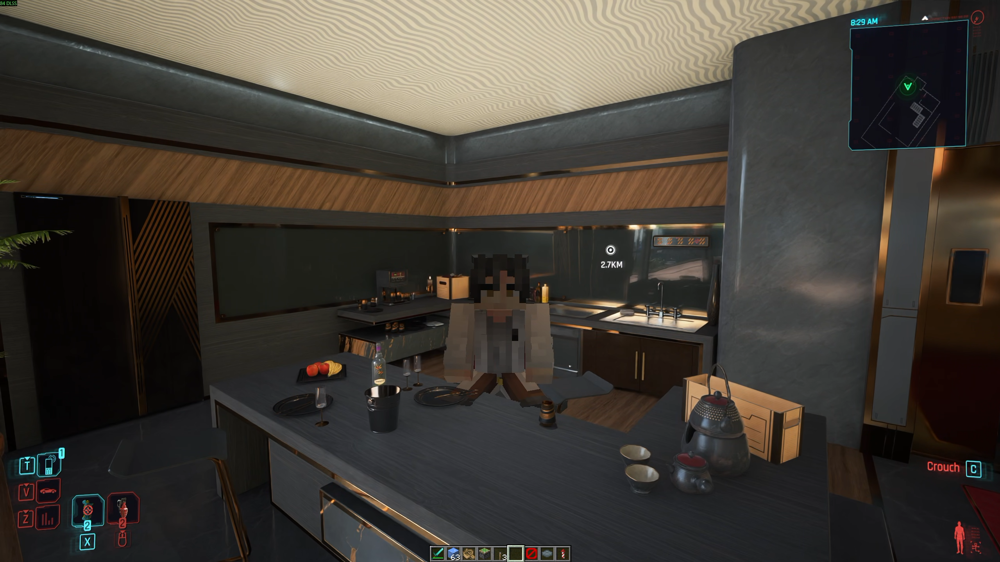

# CyberCraft



Play Cyberpunk 2077 as a Minecraft player. You run through Night City with Minecraft's movement,
carry Minecraft's inventory and HUD, build with Minecraft blocks on its streets and rooftops, and
fight its NPCs with Minecraft weapons.

Neither game is rewritten. Cyberpunk keeps its city, NPCs, quests and saves; Minecraft keeps its
own game logic. A RED4ext plugin in Cyberpunk and a Fabric mod in Minecraft share one block of
memory. Minecraft runs hidden in the background, and Cyberpunk draws the picture.

> **Status: early and experimental.** Parts of the plugin call game functions that are still being
> verified against a running game (see [docs/CYBERCRAFT.md](docs/CYBERCRAFT.md)). Expect rough
> edges and back up your saves.
>
> CyberCraft is a fan project, not affiliated with CD PROJEKT RED, Mojang or Microsoft. You need to
> own both games.

## Features

- **Movement:** Minecraft physics on Night City. Walking, sprinting, jumping, crouching, swimming
  and falling all collide with the city, which the plugin samples with ray casts around you every
  few blocks you move.
- **Overlay:** Minecraft's hand, hotbar, health and hunger, inventory and every other Minecraft
  screen, drawn into Cyberpunk's frame (D3D12).
- **Blocks:** place and break blocks anywhere. They're drawn in the world and hidden behind
  buildings, cars and people. Press **Insert** while standing on a street, facing along it, to snap
  the block grid to it, so blocks sit flush on the pavement and run along the street. The **arrow
  keys** then fine-tune it a pixel at a time. The grid is saved with your Minecraft world.
- **Builds are real in Night City:** torches, lanterns, glowstone and lava light the streets around
  them, and NPCs, cars and bullets meet the walls you build.
- **Third person:** Minecraft's **F5** pulls Cyberpunk's camera back and shows your Minecraft skin
  and armour in V's place.
- **Combat:** hit NPCs with any Minecraft weapon, bow, trident, potion or TNT. Minecraft works out
  the hit (reach, cooldown, crits, shields) and the damage lands on the NPC's health in Cyberpunk.
  Damage V takes in Cyberpunk becomes a Minecraft hurt.
- **Particles:** crits, potion swirls, splashes, smoke and block debris show up on the NPCs and
  blocks they belong to.
- **Water, time and weather:** Cyberpunk's water is Minecraft water: swim and drown in it, fill
  buckets from it, sail boats and fish on it, waterlog blocks you place in it. Minecraft's day and
  weather follow Night City's, and `/time set night` or `/weather rain` in Minecraft change Night
  City too. Weather mods such as Enhanced Weather are picked up.
- **Multiplayer (Minecraft side):** friends running CyberCraft can join your Minecraft world over
  the internet. Each of you keeps your own Night City.

## Requirements

**Cyberpunk 2077** (PC, the current patch) with [RED4ext](https://github.com/wopss/RED4ext), and
[Codeware](https://github.com/psiberx/cp2077-codeware) for lights, colliders, third person
and changing Night City's weather (without it those are off; the rest works).
DLSS (or any other Streamline feature that uses depth) is recommended: without it, blocks are hidden
behind the city a whole face at a time instead of pixel by pixel. Frame generation (DLSS, FSR or
XeSS) can stay on; that's new and not yet tried in the game, so turn it off if Minecraft's hand and
HUD are missing or flicker. With DLSS frame generation on, blocks also stay under Cyberpunk's own
HUD; without it they're drawn over it.

**Minecraft:** only a Microsoft account that owns **Minecraft: Java Edition**. CyberCraft brings the
rest: a portable [Prism Launcher](https://prismlauncher.org/) with a ready instance of Minecraft
26.3, [Fabric](https://fabricmc.net/), [Fabric API](https://modrinth.com/mod/fabric-api) and the
CyberCraft Minecraft mod. Prism downloads Minecraft and Java on its own.

Minecraft runs alongside Cyberpunk, so plan for roughly 3 GB more RAM and 1.5 GB of disk for its
files.

## Install

1. Unpack `CyberCraft-<version>.zip` into the Cyberpunk 2077 folder (or install it with Vortex). It
   adds `red4ext\plugins\CyberCraft\`.
2. Start the game. The first time, CyberCraft unpacks its Minecraft to `%LOCALAPPDATA%\CyberCraft`
   and Prism Launcher opens a small window asking you to sign in. Alt-Tab to it, sign in, and go
   back to the game. Prism then downloads Minecraft, Fabric and Java (a few minutes, once).
3. From then on it's automatic: Minecraft starts with Cyberpunk, stays hidden and silent, takes
   over V once a save has loaded, and quits when the game closes.

**Update:** unpack the new zip over the old one. Your sign-in and your Minecraft world are kept.

**Uninstall:** delete `red4ext\plugins\CyberCraft\` from the game folder and
`%LOCALAPPDATA%\CyberCraft` (Prism, its sign-in, Minecraft's files and your world).

## Controls

Minecraft owns the mouse buttons and every key it has a control on; the mouse still turns V. Keys
Minecraft has no control on are Cyberpunk's: **V** calls your car, **M** opens the map, **J** the
journal, **Z** the radio, and so on (rebind a key in Minecraft's controls and it becomes
Minecraft's). V's own weapons stay holstered while Minecraft is in its world: **Alt**, the weapon
wheel, grenades and arm cyberware do nothing until it closes. These keys are special:

| Key | Does |
|---|---|
| **Esc** | Cyberpunk's pause menu (or closes an open Minecraft screen) |
| **F** | Cyberpunk interact while it offers one (doors, terminals, loot, vehicles, dialogue); otherwise Minecraft's swap hands |
| **F9** | Cyberpunk quickload |
| **T** | Cyberpunk's phone (answer, hold for contacts) |
| **`** | Cyber Engine Tweaks overlay, if installed |
| **O** | Minecraft's pause / options menu |
| **Insert** | Snap Minecraft's block grid to the ground under V and turn it the way V faces |
| **Arrow keys** | Nudge Minecraft's block grid a pixel (1/16 block) forward, back, left or right of V; hold to keep going |

Minecraft's: **E** inventory, **/** chat and commands, **Shift** sneak, **Q** drop, the number
keys and the wheel for the hotbar, and so on. With a Minecraft screen open every key is Minecraft's.

With [Mod Settings](https://github.com/jackhumbert/mod_settings) installed, Cyberpunk's pause
menu has **Mod Settings > CyberCraft**:

- **Enable CyberCraft** turns the whole mod off and on. Off, Cyberpunk plays as it does without
  CyberCraft and Minecraft pauses in the background; on again, Minecraft picks up where V is. Off
  when the game starts, Minecraft isn't started at all until it's turned on.
- **Open Minecraft settings** closes the menu and opens Minecraft's options (video, sound,
  controls, skin) over the game.
- **Minecraft scale** is how many metres a Minecraft block is in Night City (0.75; 1 makes a block
  a metre and you as tall as V). Blocks, mobs, players and your view all scale with it. Blocks you
  already placed move when you change it, and friends sharing your world need the same value.

## Playing with friends

Only the Minecraft world is shared (blocks, items, mobs and each other); everyone needs their own
game with CyberCraft.

1. **Host:** press **O**, choose **Open to LAN**, then **Start LAN World**. The bundled
   [e4mc](https://modrinth.com/mod/e4mc) posts an address like `abc-def.e4mc.link` in chat. Click
   it to copy it and send it to your friends.
2. **Friends:** press **T** and type `/join abc-def.e4mc.link`.
3. `/leave` takes you back to your own world. If the host closes theirs, you're sent back
   automatically.

## Configuration

Create `CyberCraft.ini` in `red4ext\plugins\CyberCraft\` to change any of these. Everything is
optional; the defaults are shown.

```ini
[Minecraft]
bStartWithCyberpunk = 1             ; 0: start Minecraft yourself
sLauncher =                         ; empty: the bundled Prism Launcher
sArguments = --launch CyberCraft    ; arguments for sLauncher
fTakeoverDelay = 5                  ; seconds after you continue a loaded save before Minecraft takes over V

[Collision]
fRadius = 32                        ; scan radius around you, in blocks
iSamplesPerBlock = 2                ; more catches thinner geometry, costs frame time
iRayBudget = 2000                   ; ray casts per frame

[Combat]
fDamageToGame = 5                   ; Minecraft damage -> NPC health
fDamageFromGame = 0.2               ; health V loses (percent) -> Minecraft damage
fRememberSeconds = 30               ; how long a hit or targeted NPC stays in the fight

[World]
fMetresPerBlock = 0.75              ; how big a Minecraft block is in Night City; 1: a metre, as tall as V
bSceneDepth = 1                     ; hide blocks behind the city using the game's depth (DLSS)
bHudMask = 1                        ; keep blocks under the game's HUD (needs frame generation on)
fLightGain = 1.7                    ; how bright Night City's light makes blocks, mobs and your hand
fLightColor = 0.85                  ; how much of Night City's colour that light keeps (0 grey, 1 all)
bLitHand = 1                        ; 0: your hand and held item keep Minecraft's own light
fNudgeBlocks = 0.0625               ; how far one arrow key press moves the block grid, in blocks

[Puppet]
fMaxPushback = 0.25                 ; metres V may stand off Minecraft's player near walls (stops the shake); 0: off

[Body]
bHideV = 1                          ; 0: V's own body when you look down, as before
bMinecraftBody = 1                  ; your Minecraft skin in her place; 0: no body at all

[Weather]
bSync = 1                           ; 0: Minecraft's weather and Night City's stay apart
sRain =                             ; state /weather rain sets; empty: a weather mod's once seen, else 24h_weather_rain
sThunder =                          ; state /weather thunder sets; empty: a mod's storm once seen, else sRain's

[Debug]
bDiagnostics = 0                    ; detailed logs, and a dump of the game classes the plugin uses
```

A custom launcher needs an instance with Minecraft 26.3, Fabric Loader 0.19.5 or newer, Fabric API,
Java 25 and the mod jar from the release. Every key, with what it does, is in
[docs/CYBERCRAFT.md](docs/CYBERCRAFT.md#configuration).

## Known limitations

- With frame generation on, Minecraft is drawn on the game's real frames and frame generation
  carries it into the generated ones like the game's HUD, so blocks move at the real frame rate in
  a fast turn. New and not yet tried in the game.
- Collision comes from ray casts, so thin things (railings, grilles, wires) can be missed.
- Combat follows the NPC under your crosshair and the last few you fought, not every NPC around.
- You can't dig into the city itself.
- Lights, colliders, third person and your skin in first person are new and haven't been tried in
  the game yet; how they
  should behave, and what to tune, is in [docs/ROADMAP.md](docs/ROADMAP.md).
- No save snapshots yet: loading an older Cyberpunk save doesn't rewind your Minecraft world.
- There is one block grid for the whole world. Turning it with **Insert** turns it about where you
  stand, so builds near you barely move but builds far away swing round with it.
- Some spots on stairs can still stop you; jump over them.

If something goes wrong, `red4ext\logs\CyberCraft.log` in the game folder says what. Set
`bDiagnostics = 1` before sending a bug report.

## Building

You need Visual Studio 2022 with C++, CMake 3.25+, Git and JDK 25.

```bat
git clone --recursive https://github.com/YoGoUrT20/cybercraft.git
cd cybercraft\red4ext
cmake --preset default
cmake --build --preset release

cd ..\fabric
gradlew build

cd ..
powershell -ExecutionPolicy Bypass -File tools\package.ps1 -NoBuild
```

`tools\package.ps1` (without `-NoBuild`, it builds both halves too) writes the release zips to
`dist\`. Set `CYBERCRAFT_DEPLOY_DIR` to `<game>\red4ext\plugins\CyberCraft` before configuring and
each plugin build is copied straight into the game.

**Build and install in one step:** close the game and double-click `install.bat`. It builds both
halves, packs the release and installs it over whatever version is in the game, keeping your
`CyberCraft.ini`. If Vortex installed CyberCraft, Vortex's copy is updated too (its links are kept),
so there's nothing to remove or drag into Vortex. The next start of the game updates the Minecraft
side. `install.bat -NoBuild` installs the last build; `-Game "<folder>"` if the game isn't found.

For development:

- `tools\launch_minecraft.bat` starts a dev Minecraft (`gradlew runClient`) that waits for the game.
- `tools\fake_cyberpunk.py` stands in for the plugin, so the Minecraft mod can be tested without
  the game; `tools\fake_guest.py` runs a second one next to a real game.
- `tools\cet.ps1` runs Lua in the live game through the Cyber Engine Tweaks dev console in
  `tools\cet-devconsole\`.

| Folder | |
|---|---|
| `red4ext/` | The Cyberpunk 2077 plugin (C++, [RED4ext.SDK](https://github.com/wopss/RED4ext.SDK)) |
| `fabric/` | The Minecraft Fabric mod (Java) |
| `protocol/` | The shared-memory layout both sides follow |
| `tools/` | Packaging, test stand-ins and diagnostics |
| `docs/` | How it works (DESIGN), what's built and unverified (CYBERCRAFT), what's next (ROADMAP) |

## Contributing

Bug reports, in-game testing and pull requests are welcome: see [CONTRIBUTING.md](CONTRIBUTING.md).
Report security issues privately, as described in [SECURITY.md](SECURITY.md).

## License

MIT, see [LICENSE](LICENSE). Bundled third-party components are listed in
[THIRD-PARTY-NOTICES.md](THIRD-PARTY-NOTICES.md).

Cyberpunk 2077 is a trademark of CD PROJEKT S.A. Minecraft is a trademark of Mojang Synergies AB.
CyberCraft is a fan project and isn't affiliated with or endorsed by either.
